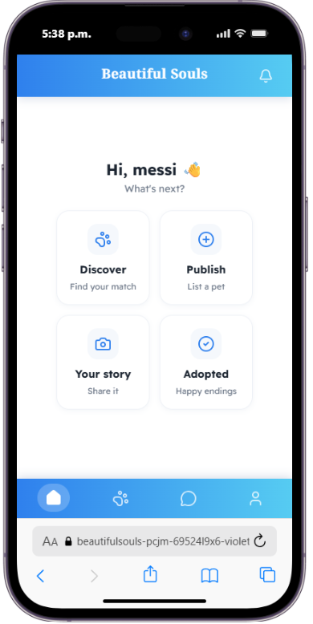

<h1 align="center">🐾 Beautiful Souls</h1>

<p align="center">
  <strong>Swipe. Match. Adopt.</strong>
</p>

<p align="center">
  A mobile-first web application built with <strong>React</strong> that connects animal shelters and individual owners with potential adopters through swipe-based discovery, direct real-time chat, and a community wall of adoption stories.
</p>

<p align="center">
  
</p>

---

# 📂 Source Code

Frontend repository:

https://github.com/violetaatkinson/beautiful-sols-react

Backend repository:

https://github.com/violetaatkinson/Proyect---Beautiful---Souls

Live app:

https://beautifulsouls.vercel.app/login

---

# ✨ Main Features

## 🐕 Discover

* Tinder-style swipe deck to browse adoptable pets, with drag gestures and spring animations.
* Full pet profile: health info, personality traits, compatibility with kids/dogs/cats, adoption requirements, fee, and rescue date.
* Distance-aware sorting when the browser shares your location.

## 💬 Chat

* Direct, real-time messaging with a pet's owner (Socket.IO), reachable straight from the swipe card or the pet's profile.
* Conversations are scoped **per pet**, not just per person — talking to the same owner about two different pets keeps two separate threads.
* Live "typing…" indicator.

## 🦮 Publish & manage listings

* Multi-step wizard to list a pet (basic info → photos → traits → requirements), up to 4 photos.
* "My Listings" screen to edit or delete your own pets.

## 🤝 Matches

* See who liked your pets and jump straight into a conversation about that specific listing.

## 🎞️ Pet Stories

* A community wall to share a pet you've loved — happy adoption or otherwise.

## 🔔 Notifications

* Likes, new messages, and publish confirmations, with a clear-all option.

## 👤 Profile & accounts

* Individual or shelter account types, with a verified badge for shelters.
* Edit profile, log out, delete account.

---

# 🛠️ Technologies Used

### Frontend

* React 18 (Create React App)
* React Router v6
* JavaScript ES6+
* Axios
* Formik + Yup (auth forms)

### Real-time & Interaction

* Socket.IO Client
* @react-spring/web
* @use-gesture/react

### UI

* lucide-react (icons)
* Bootstrap (base utilities) + custom CSS per screen
* Custom hooks (`useGeolocation`)

### Auth & Session

* JWT (`jwt-decode`)
* localStorage-based access token persistence
* React Context (`AuthContext`, `SocketContext`)

---

# 📂 Project Structure

```text
beautiful-sols-react/
│
├── public/
│
├── src/
│   ├── assets/            Static images
│   ├── components/misc/   Navbar, Dashboard (bottom nav), Search, route guards
│   ├── constants/
│   ├── contexts/          AuthContext, SocketContext
│   ├── helpers/            JWT verification helper
│   ├── hooks/               useGeolocation
│   ├── layout/              NavbarLayout
│   ├── screens/              Home, Login, Register, Pets (AdoptionList, PetDetail,
│   │                          NewAdoption, MyPetsCreated), Profile, Chat, ListUsers,
│   │                          Notifications, Adopted (NewAdopted, ListAdopted)
│   ├── services/              PetService, UserService, MessageService, AdoptedService,
│   │                          NotificationService, AuthService, BaseService
│   ├── token/                 Access token storage helpers
│   └── utils/                  Pet badges, age formatting
│
├── App.js
├── index.js
└── package.json
```

---

# 📱 Installation & Testing

## Try it live

https://beautifulsouls.vercel.app/login

The app is mobile-only by design — on screens wider than 600px it shows a "please open on your phone" message instead of the UI. Use your browser's device toolbar / responsive mode to preview it on desktop.

## Run locally

Requires the [backend](https://github.com/violetaatkinson/Proyect---Beautiful---Souls) running (locally or deployed) to actually load data.

---

# 🧪 Development Testing

Install dependencies:

```bash
npm install
```

Create a `.env` file in the project root:

```
REACT_APP_API_URL=http://localhost:3001/api
```

Start the app:

```bash
npm start
```

Opens at [http://localhost:3000](http://localhost:3000).

Other scripts:

```bash
npm run build   # production build
npm test        # test runner
```

---

# 🚀 Future Improvements

* Push notifications.
* Read receipts and message editing in chat.
* Filters on the discover deck (species, size, distance range).
* Multi-photo carousel editing directly in "My Listings".
* Shelter dashboard with adoption analytics.
* Progressive Web App (installable, offline-friendly).

---

# 🎯 Project Goal

Beautiful Souls was built to explore how a familiar, high-engagement interaction pattern — the swipe deck — can be repurposed for a good cause: helping shelters and owners find the right home for a pet, and making it effortless to go from "I like this pet" to "I'm talking to their owner." The project covers a full mobile-first UI, gesture-based interactions, geolocation, image uploads, and real-time communication end to end.

---

# 👩‍💻 Author

**Violeta Atkinson**
